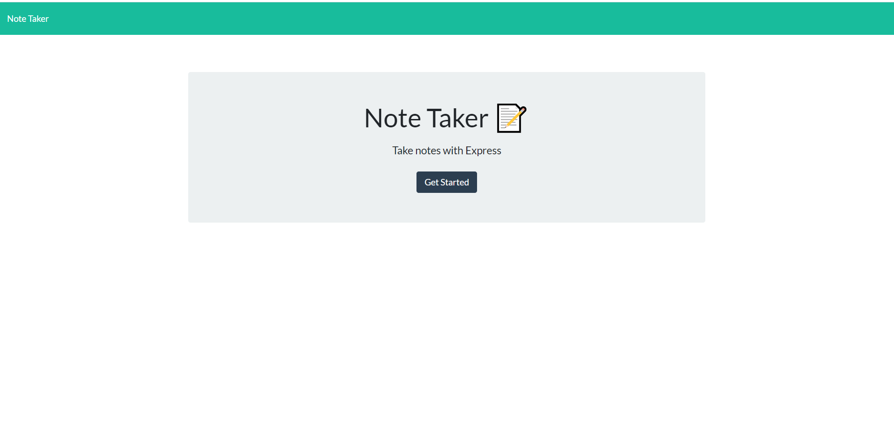
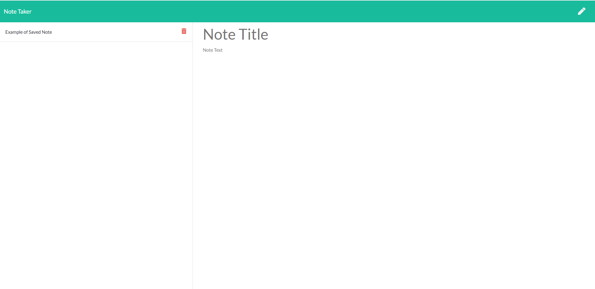

# Note-Taker

  
## Description 
This application can be used to write, save, and delete notes. Note-taker uses an express backend as well as it saves and retrieves note data from a JSON file. 

## Table of Contents 
* [Installation](#Installation)
* [Usage](#Usage)
* [License](#License)
* [Contributing](#Contributing)
* [Tests](#Tests)
* [Visuals](#Visuals)
* [Links](#Links)
* [Questions](#Questions)

## Installation
Run npm install in your command terminal

## Usage
Run nodemon server.js to begin the program

## License
Copyright (c) 2020, Kayla Newlon. (MIT License)

## Contributing 
No guidelines at this time 

## Tests
No tests available 

## Visuals

## Links
To Repo: https://github.com/kbnewlon/note-taker
 Visit the deployed link on Heroku to demo: https://kbnewlon-note-taker.herokuapp.com/
 

## Questions 
Please contact me if you have any questions at:
 Email: kbnewlon@hotmail.com
 Github: https://github.com/kbnewlon

